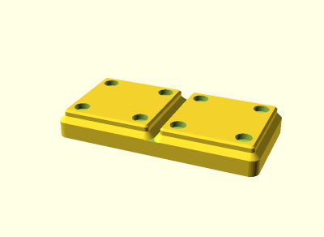

# oscad-gridfinity

[GridFinity](https://gridfinity.xyz/) implementation for [OpenSCAD](https://openscad.org/)



Create fully parameterized Templates for GridFinity.

`gridfinity(<x>, <y>, <z>, lip=<>, magnets=<>);`

* **x, y** Vertical size in *GridFinity* units
* **z** Height in GridFinity units (`z * 7mm`). This in excluding the base and stacking lip.
* **lip** `true/false` Sets wether to put a stacking lip on top. Only works with z >= 1.
* **magnets** `true/false` Sets wether to put holes for magnets in the base.

## Example

```scad
use <gridfinity.scad>

gridfinity(2, 1, 2, lip=true, magnets=false);
```

## Building

STLs and PNGs can be built with GNU make by just running
`make stl` and `make png`
respectively.

T build a single object, use the desired file as a target:
`make example.stl`

## License

Licensed under the MIT License. Consult `LICENSE`.
